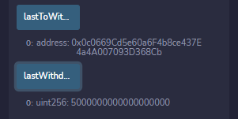

# Joint_Savings_Account

To automate the creation of joint savings accounts, I created a Solidity smart contract that accepts two user addresses. These addresses are able to withdraw funds from the account.

## Testing The Deployed Contract

The 'setAccounts' function defines the authourized Ethereum addresses able to withdraw funds from the contract:

Testing the deposit functionality of the contract and the 'contractBalance' function to verify funds were added to the contact.

Transaction 1: Deposit 1 ether as wei:

Transaction 2: Deposit 10 ether as wei:

Transaction 3: Deposit 5 ether:

Testing the contracts withdrawal functionality.

Withdrawing 5 ether into 'accountOne':

Using the 'lastToWithdraw' and 'lastWithdrawAmount' functions to verify that the address and amount were correct:

Withdrawing 10 ether into 'accountTwo':

Verifying address and amount were correct:

## Contributors

Owen Harris

